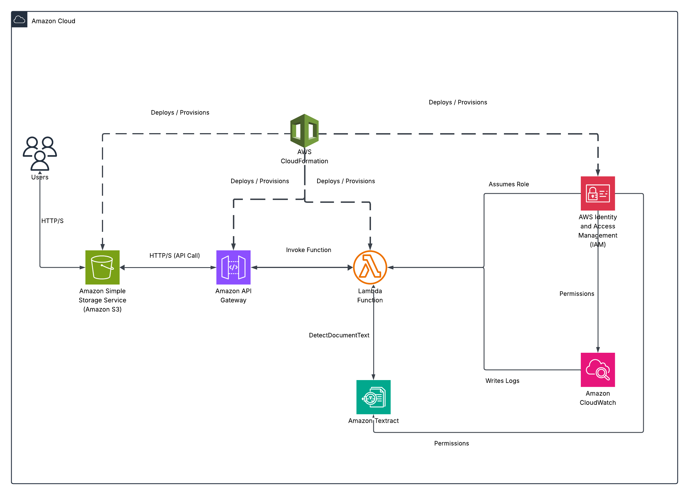

📝 AWS OCR Project – Serverless Text Extraction

🔍 A fully serverless OCR (Optical Character Recognition) solution built on AWS that extracts text from images using ("Amazon Textract"), with infrastructure provisioned via ("CloudFormation").

🌐 Live Demo

👉 Try it now: http://ocr-light-website.s3-website-us-east-1.amazonaws.com/

⚙️ Technologies Used

- ☁️ "Amazon S3" – Hosts the frontend website.
- 🌐 "Amazon API Gateway" – Accepts secure HTTP requests from users.
- 🧠 "AWS Lambda" – Executes the OCR logic.
- 📄 "Amazon Textract" – Extracts text from uploaded images.
- 🔐 "AWS IAM" – Manages roles and permissions securely.
- 📊 "Amazon CloudWatch" – Logs API and Lambda activity.
- 🧱 "AWS CloudFormation" – Automates infrastructure deployment.

🧭 How It Works

1. 🌍 The user accesses the frontend hosted on "S3".
2. 📤 Uploads an image via "API Gateway".
3. ⚙️ "Lambda" is triggered and processes the image.
4. 🔍 Lambda invokes "Amazon Textract" to extract text.
5. 📬 The extracted text is returned to the user.
6. 🛠 Logs and monitoring are handled via "CloudWatch".
7. 🧱 All resources are deployed using "CloudFormation" templates.

🗂 Architecture

  

